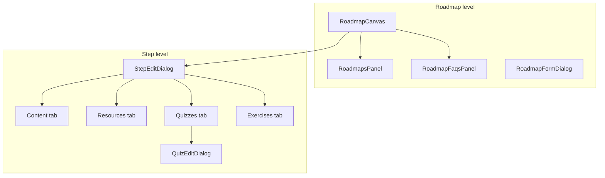

# Implementation Plan: FAQs, Quizzes & Exercises

Three phases, ordered by complexity and dependency. Each phase is independently shippable.

---

## Overview

| Phase | Scope | Primary entry point | Pattern to reuse |
|-------|--------|---------------------|------------------|
| **1** | Exercises (step) | `StepEditDialog` → Exercises tab | `ResourceEditorList` |
| **2** | Quizzes (step) | `StepEditDialog` → Quizzes tab → `QuizEditDialog` | Tab + nested dialog |
| **3** | FAQs (roadmap) | `RoadmapFaqsPanel` on canvas | `RoadmapsPanel` + `RoadmapFormDialog` |

### Data ownership

| Feature | Assigned to | API base |
|---------|-------------|----------|
| FAQs | Roadmap | `/roadmaps/{slug}/faqs/` |
| Quizzes | Roadmap step | `/roadmaps/{slug}/quizzes/` (`step` field) |
| Exercises | Roadmap step | `/roadmaps/{slug}/exercises/` (`step` field) |

### Architecture diagram



### Timeline estimate

| Phase | Effort |
|-------|--------|
| Phase 1 — Exercises | ~2–3 days |
| Phase 2 — Quizzes | ~4–5 days |
| Phase 3 — FAQs | ~2–3 days |
| **Total** | **~8–11 days** |

*Assumes backend CRUD endpoints are available.*

---

## Phase 1 — Exercises (step-scoped, inline)

### Goal

Editors can list, create, edit, and delete exercises for a step from a new **Exercises** tab in `StepEditDialog`.

### Why first

- Flat data model (`title`, `description`, `difficulty`, `solution_url`)
- Mirrors `ResourceEditorList` closely
- Exercises are independent API entities — no nested children

### 1.1 API layer

Extend `src/lib/api/exercises.ts`:

| Method | Endpoint | Purpose |
|--------|----------|---------|
| `GET` | `/roadmaps/{slug}/exercises/?step={id}` | List by step *(exists)* |
| `POST` | `/roadmaps/{slug}/exercises/` | Create |
| `PATCH` | `/roadmaps/{slug}/exercises/{id}/` | Update |
| `DELETE` | `/roadmaps/{slug}/exercises/{id}/` | Delete |

Add types in `src/types/exercise.ts`:

```ts
export type CreateExerciseInput = {
  step: number
  title: string
  description: string
  difficulty: ExerciseDifficulty
  solution_url: string
}

export type UpdateExerciseInput = Partial<CreateExerciseInput>
```

### 1.2 Hooks

Extend `src/hooks/useExercises.ts`:

- `useCreateExercise()` — invalidate `exerciseKeys.list(slug, { step })`
- `useUpdateExercise()`
- `useDeleteExercise()`

### 1.3 Shared primitive

Create `src/components/shared/DifficultySelect.tsx`:

- Reused in Phase 2 for quizzes
- Values: `easy` | `medium` | `advanced`

### 1.4 UI components

```
src/components/dialogs/step-edit/
  ExercisesTab.tsx           # Tab shell: loading, empty, list
  ExerciseEditorList.tsx     # Add/remove cards
  ExerciseEditorCard.tsx     # Single exercise form + save/delete
```

**`ExercisesTab` props:**

```ts
{ slug: string; stepId: number }
```

**Behavior:**

1. On tab open, `useExercises(slug, { step: stepId })`
2. "Add exercise" → local draft card (or immediate POST with defaults)
3. Per-card **Save** → `useCreateExercise` / `useUpdateExercise`
4. **Delete** → confirm via existing `DeleteConfirmDialog` pattern
5. Validate: title required, `solution_url` must be a valid URL

### 1.5 `StepEditDialog` changes

- Add tab: `Content | Resources | Exercises`
- Pass `selectedSlug` + `node.data.stepId` into `ExercisesTab`
- Exercises tab is **independent** of step Save — step save still only handles label/content/priority/resources

### 1.6 Task list

1. Types + API client for exercise CRUD
2. Mutation hooks + query invalidation
3. `DifficultySelect`
4. `ExerciseEditorList` + `ExerciseEditorCard`
5. `ExercisesTab`
6. Wire into `StepEditDialog`
7. Manual test on a step with persisted ID

### 1.7 Acceptance criteria

- [ ] Exercises tab visible when editing a step with a persisted `stepId`
- [ ] Tab disabled or shows message if step is unsaved (no `stepId` yet)
- [ ] List filtered to current step only
- [ ] Create, edit, delete work without closing step dialog
- [ ] Loading and error states shown
- [ ] Empty state: "No exercises yet. Add one to attach practice work to this step."

---

## Phase 2 — Quizzes (step-scoped, nested)

### Goal

Editors can manage quizzes per step: list summaries in the step dialog, open a dedicated editor for quiz metadata and questions/choices.

### Why second

- Nested model: Quiz → Questions → Choices
- Needs list + detail API and more validation
- Benefits from `DifficultySelect` built in Phase 1

### 2.1 API layer

Extend `src/lib/api/quizzes.ts`:

| Method | Endpoint | Purpose |
|--------|----------|---------|
| `GET` | `/roadmaps/{slug}/quizzes/?step={id}` | List by step |
| `GET` | `/roadmaps/{slug}/quizzes/{id}/` | Detail with questions |
| `POST` | `/roadmaps/{slug}/quizzes/` | Create *(exists)* |
| `PATCH` | `/roadmaps/{slug}/quizzes/{id}/` | Update metadata |
| `DELETE` | `/roadmaps/{slug}/quizzes/{id}/` | Delete |
| `POST` | `.../quizzes/{id}/questions/` | Create question *(exists)* |
| `PATCH` | `.../questions/{qid}/` | Update question |
| `DELETE` | `.../questions/{qid}/` | Delete question |

Add `QuizzesListParams` with `step?: number` in `src/types/quiz.ts`.

Add `QuizDetail` type including `questions: QuizQuestion[]`.

Update `quizKeys.list` in `src/lib/api/queryKeys.ts` to accept params: `list(slug, params?)`.

### 2.2 Hooks

Extend `src/hooks/useQuizzes.ts`:

- `useQuizzes(slug, { step })` — list query
- `useQuiz(slug, quizId)` — detail query
- `useUpdateQuiz()`, `useDeleteQuiz()`
- `useUpdateQuizQuestion()`, `useDeleteQuizQuestion()`
- Keep existing `useCreateQuiz`, `useCreateQuizQuestion`

### 2.3 UI components

```
src/components/dialogs/step-edit/
  QuizzesTab.tsx
  QuizSummaryCard.tsx

src/components/dialogs/quiz/
  QuizEditDialog.tsx         # max-w-4xl, max-h-[90vh]
  QuizMetadataForm.tsx
  QuestionEditorList.tsx
  QuestionEditorCard.tsx
  ChoiceEditorList.tsx
  QuestionTypeSelect.tsx
```

### 2.4 `QuizzesTab` flow

1. List quizzes for step via `useQuizzes`
2. Each `QuizSummaryCard`: title, difficulty badge, question count, Edit / Delete
3. "Add quiz" → open `QuizEditDialog` in create mode (`step` pre-filled)
4. Edit → open `QuizEditDialog` in edit mode

### 2.5 `QuizEditDialog` structure

```
┌─ Quiz metadata (title, description, difficulty) ─┐
├─ Questions (accordion)                          │
│   ├─ Question 1 [single_choice]                 │
│   │   ├─ Text, explanation                      │
│   │   └─ Choices (text + is_correct)            │
│   └─ + Add question                             │
└─ Footer: Cancel | Save quiz                     │
```

### 2.6 Validation rules (client-side)

| Type | Rules |
|------|--------|
| `true_false` | Exactly 2 choices, 1 correct |
| `single_choice` | ≥2 choices, exactly 1 correct |
| `multiple_choice` | ≥2 choices, ≥1 correct |
| All | Question text required; each choice text required |

**Question type changes:** reset choices to sensible defaults (e.g. True/False for `true_false`).

### 2.7 `StepEditDialog` changes

- Add tab: `Content | Resources | Exercises | Quizzes`
- Optional tab badges: `Quizzes (2)` from list count
- Render `QuizEditDialog` as sibling (like `DeleteConfirmDialog` in `RoadmapCanvas`)

### 2.8 State management

- **Quiz list:** React Query (server state)
- **Quiz editor:** local form state in `QuizEditDialog`
- Prefer **save per question** to avoid losing work on large quizzes

### 2.9 Task list

1. Types + API for quiz list/detail/update/delete + question CRUD
2. Query/mutation hooks
3. `QuizzesTab` + `QuizSummaryCard`
4. `QuizEditDialog` shell + metadata form
5. `QuestionEditorList` + `ChoiceEditorList` + validation
6. Wire into `StepEditDialog` + tab badges

### 2.10 Acceptance criteria

- [ ] Quizzes tab lists only quizzes for current step
- [ ] Create quiz opens editor with `step` set
- [ ] Edit quiz loads detail with questions
- [ ] Add/edit/delete questions and choices
- [ ] Validation blocks invalid choice configurations
- [ ] Delete quiz confirms before removal
- [ ] Tab shows count badge when quizzes exist

---

## Phase 3 — FAQs (roadmap-scoped, side panel)

### Goal

Editors manage roadmap FAQs from a collapsible right panel on the canvas, without opening step or roadmap metadata dialogs.

### Why last

- Different scope (roadmap, not step)
- Simpler than quizzes but different UI placement
- Does not block Phases 1–2

### 3.1 API layer

Extend `src/lib/api/faqs.ts`:

| Method | Endpoint | Purpose |
|--------|----------|---------|
| `GET` | `/roadmaps/{slug}/faqs/` | List *(exists)* |
| `POST` | `/roadmaps/{slug}/faqs/` | Create *(exists)* |
| `PATCH` | `/roadmaps/{slug}/faqs/{id}/` | Update |
| `DELETE` | `/roadmaps/{slug}/faqs/{id}/` | Delete |
| `PATCH` | `/roadmaps/{slug}/faqs/reorder/` | Reorder *(optional)* |

Add `UpdateFaqInput` in `src/types/faq.ts`.

### 3.2 Hooks

Extend `src/hooks/useFaqs.ts`:

- `useUpdateFaq()`
- `useDeleteFaq()`
- `useReorderFaqs()` *(optional, if API exists)*

### 3.3 UI components

```
src/components/panels/
  RoadmapFaqsPanel.tsx       # Right-side collapsible card

src/components/panels/faqs/
  FaqList.tsx
  FaqListItem.tsx
  FaqEmptyState.tsx

src/components/dialogs/
  FaqFormDialog.tsx          # question + answer fields
```

### 3.4 `RoadmapFaqsPanel` layout

Mirror `RoadmapsPanel` on the opposite side:

```
┌─ FAQs ──────────────────────── [+] [collapse] ─┐
│  Search (optional)                              │
│  ┌─ FAQ 1: "What is..." ────────── [edit][del] │
│  ┌─ FAQ 2: "How do I..." ────────── [edit][del] │
│  ...                                            │
└─────────────────────────────────────────────────┘
```

- **Placement:** `absolute right-4 top-4` on canvas
- **Entry point:** button in top-right `Panel` in `RoadmapCanvas.tsx`, or toggle collapse like the left panel

### 3.5 `FaqFormDialog` fields

- Question (required)
- Answer (required) — textarea or `MarkdownEditorField` if answers support markdown

### 3.6 Integration in `RoadmapCanvas`

- Add `RoadmapFaqsPanel` inside `ReactFlow` (or as sibling)
- Pass `selectedSlug` from context
- Hide or disable when no roadmap is selected

### 3.7 Optional enhancements

- Drag-to-reorder in `FaqList` (if `order` + reorder API exist)
- Search filter (API already supports `search`)
- FAQ count in navbar next to roadmap title

### 3.8 Task list

1. Types + API for FAQ update/delete
2. Mutation hooks
3. `FaqFormDialog`
4. `FaqList` + `FaqListItem`
5. `RoadmapFaqsPanel`
6. Wire into `RoadmapCanvas` + entry button

### 3.9 Acceptance criteria

- [ ] Panel visible only when a roadmap is selected
- [ ] List loads FAQs for current roadmap
- [ ] Create / edit / delete via `FaqFormDialog`
- [ ] Panel collapses without losing selection
- [ ] Empty state when no FAQs
- [ ] Does not interfere with canvas pan/zoom

---

## Cross-phase foundations

### Final file structure

```
src/
  components/
    dialogs/
      FaqFormDialog.tsx
      quiz/
        QuizEditDialog.tsx
        QuizMetadataForm.tsx
        QuestionEditorList.tsx
        QuestionEditorCard.tsx
        ChoiceEditorList.tsx
        QuestionTypeSelect.tsx
      step-edit/
        ExercisesTab.tsx
        ExerciseEditorList.tsx
        ExerciseEditorCard.tsx
        QuizzesTab.tsx
        QuizSummaryCard.tsx
    panels/
      RoadmapFaqsPanel.tsx
      faqs/
        FaqList.tsx
        FaqListItem.tsx
        FaqEmptyState.tsx
    shared/
      DifficultySelect.tsx
      OrderedListHeader.tsx
      EntityEmptyState.tsx
  hooks/
    useExercises.ts    # extended
    useQuizzes.ts      # extended
    useFaqs.ts         # extended
  lib/api/
    exercises.ts       # extended
    quizzes.ts         # extended
    faqs.ts            # extended
  types/
    exercise.ts        # extended
    quiz.ts            # extended
    faq.ts             # extended
```

### Shared UX rules

1. **Unsaved step guard:** tabs that need `stepId` show: "Save the step to the server before adding exercises/quizzes."
2. **Independent saves:** exercises, quizzes, and FAQs save via their own mutations — not bundled into step/roadmap save.
3. **Consistent empty states:** same copy pattern as `ResourceEditorList`.
4. **Delete confirmation:** reuse `DeleteConfirmDialog` with entity-specific messages.

### Backend dependency checklist

Confirm with backend before starting each phase:

| Feature | Needed for |
|---------|------------|
| Exercise CRUD | Phase 1 |
| Quiz list + detail + update/delete | Phase 2 |
| Question update/delete | Phase 2 |
| FAQ update/delete | Phase 3 |
| FAQ reorder endpoint | Phase 3 *(optional)* |

---

## Optional Phase 4 (future)

- Step node badges showing quiz/exercise counts on `MainStepNode` / `SubStepNode`
- Bulk import/export for quiz questions
- FAQ preview mode (accordion render as end-users would see it)
